# 暗网交易市场监控爬虫工具 Ver 1.0 

PS:该工具为我去年4月左右写的，后来被我遗忘在我的代码库中了，如果有兴趣的可自行二开成自己的平台


## 1 、工具简介

该工具为暗网交易市场的爬虫工具，主要收集对应暗网平台的所有售卖链接、内容、信息、URL等信息供使用者作为数据监控的样本资料（带去重功能），软件整体分为爬虫模块以及数据存储模块，构造比较简单，（Pyweb写不来，~~因此"webserver"文件夹是废的~~，可用Grafana作为数据的显示载体），运行效果图如下：

数据库测试数据

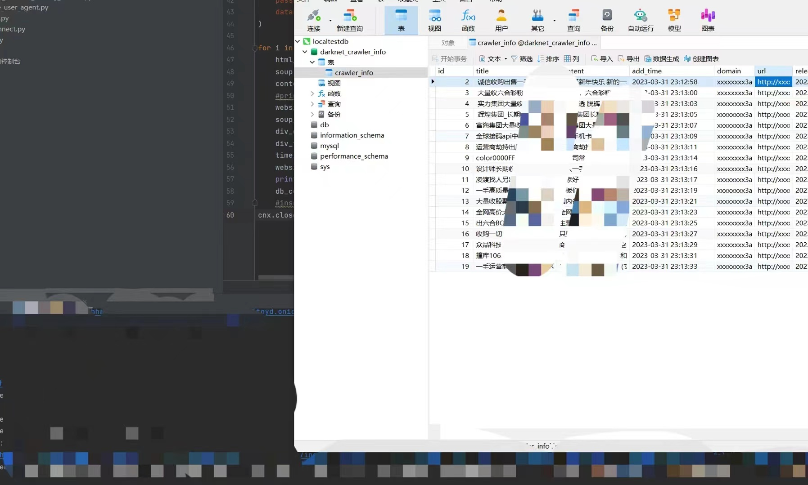

使用Grafana进行数据展示：

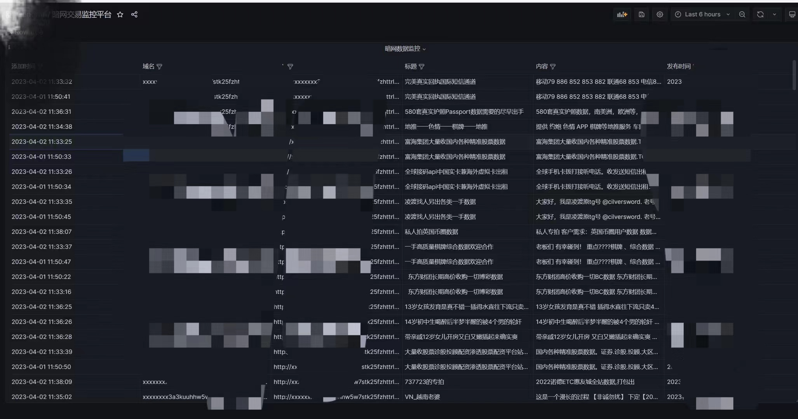

## 2、文件结构介绍

该处将列举几个关键的文件进行介绍

### 2.1 Config.py

该文件为配置文件，主要包含tor网桥的代理信息（socks5h可转发DNS请求）、数据库的链接信息，爬虫文件所在目录（**crawler_file_mode**），以及删除N天前的记录（**delete_data_time**）

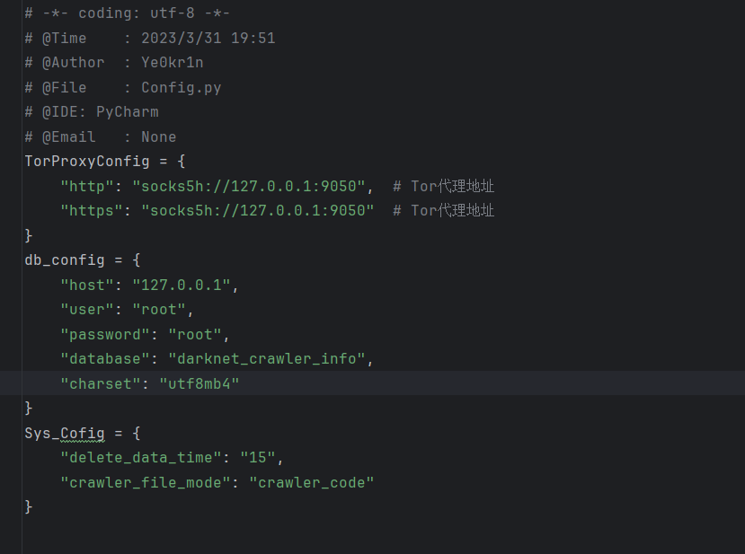

## 2.2 文件夹	./crawler_code/

该文件夹下为爬虫的配置信息**crawler.json**以及爬虫脚本代码等文件

### 2.2.1 ./crawler_code/crawler.json

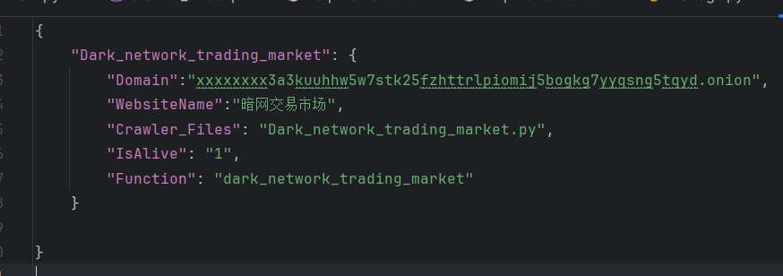


该json文件中主要配置暗网的对应**onion**域名，网址名称，爬虫文件对应文件名，**IsAlive**为是否开启，**Function**为脚本命名，主要在**main**中有调用，因此，如有自写爬虫脚本，可放该目录下并配置号**crawler.json**即可使用

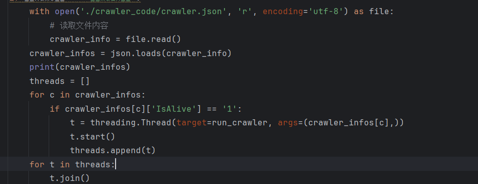

#### 2.2.2 ./crawler_code/fake_user_agent.py

user_agent头字典，防止有些网址反爬

### 2.2.3 数据库结构

数据库结构较简单，如下所示，仅做爬虫对应的信息记录

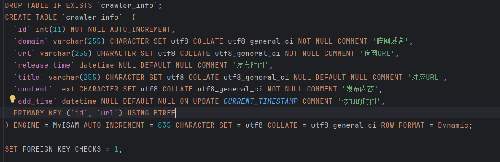

### 2.2.4 入库函数

在文件db_connect.py中的第22行

```
insert_darknet_crawler_data(cnx,Domain,URL,ReleaseTime,Title,Content,add_time)
```

Domain为暗网域名，URL你懂的，ReleaseTime为发布日期，Title为标题，Content为对应内容，add_time为爬虫入库日期

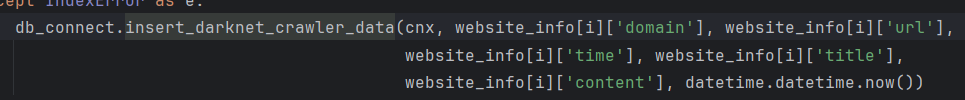

在爬虫文件中存在判重去重操作，其中原理可自行理解

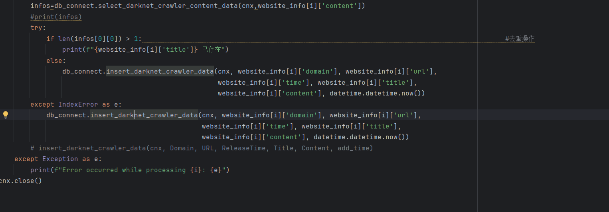


# 3、部署

tor建立工具可在链接: https://www.torproject.org/download/tor/ 中下载

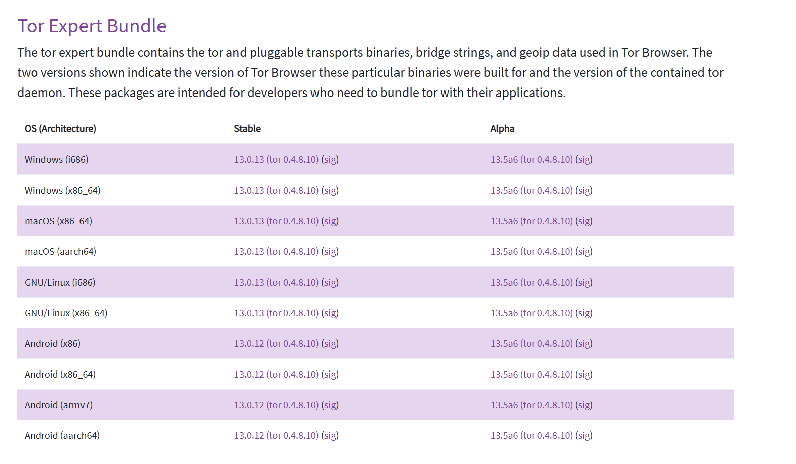

首先将**darknet_crawler_info.sql**导入至数据库，接着修改**Config.py**将对应数据库配置信息修改，接着部署Tor网桥，Windows下可下载Tor浏览器，在其安装路径**.\Browser\TorBrowser\Tor**下的**tor.exe**启动 ，也可自行去torproject下载tor网桥，Linux下可直接apt安装tor，由于有GFW限制，因此需首先安装梯子接着去**/etc/tor/torrc**下修改对应“**Socks5Proxy**”配置：

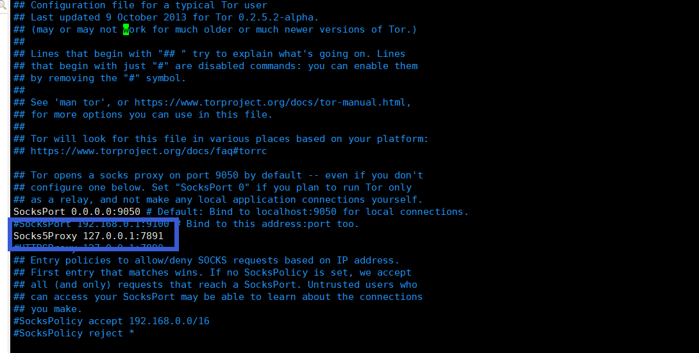

**SocksPort**的配置信息为Tor服务的监听端口，对应**Config.py**中的**"TorProxyConfig"**配置信息

接着挂梯子运行命令行"tor"，出现"100%(done)"时表示成功建立链接 <u>	//（该步骤仅为测试tor网络是否能通，如已确认tor网桥能通，则直接service tor start即可，无需经过此步骤）</u>

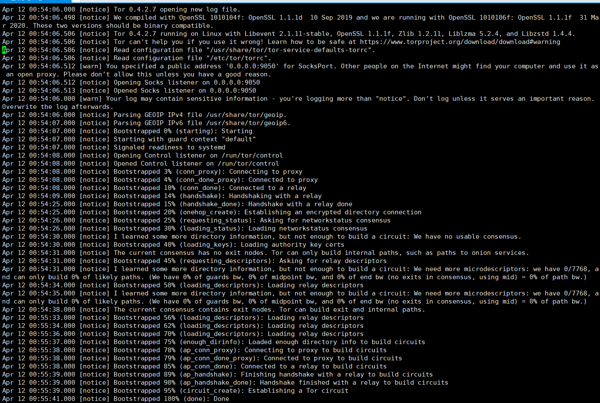

再使用main运行即可，如果想数据直观显示可自行开发对应界面展示数据或者偷个懒直接使用Grafana显示对应数据

总体的数据走向为:

**本地——梯子——Tor网桥——onion域名**

在测试连通后系统就会开始爬虫并将对应数据放置在数据库中，可对系统设置计划任务，每日自动爬虫以获取最新的信息并最终展示在Grafana中，也可设置监控关键字，在爬虫后进行进一步筛选关键字的内容，以作监控功能使用，最终展示效果如下图所示：

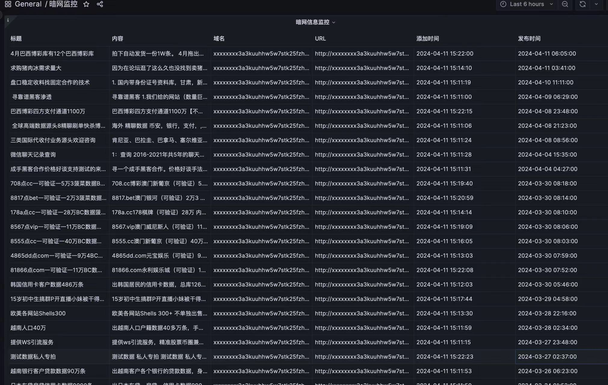

By:Ye0kr1n

2024-4-14